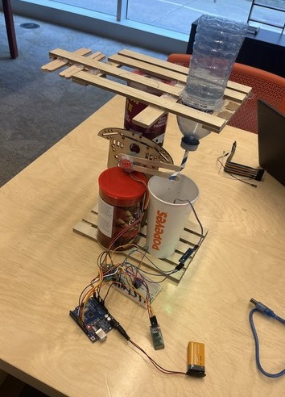
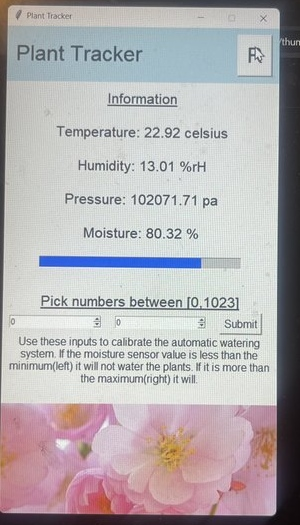

# Autonomous-Plant-Care-System

Second place winner of UTRAHacks 2024 open challenge. [Devpost](https://devpost.com/software/plant-care-system)

## Device
Detects soil moisture and turns motar to water plant inside cup. Also has sensors for altitude, pressure, tempreture and humidity. This information is trasmitted through bluetooth.  

## GUI

Displays all information recived from the device. Also can control moisutre levels at which plant should and shouldn't be watered.   

